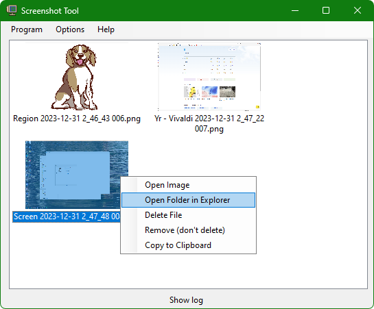
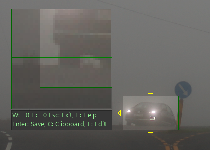
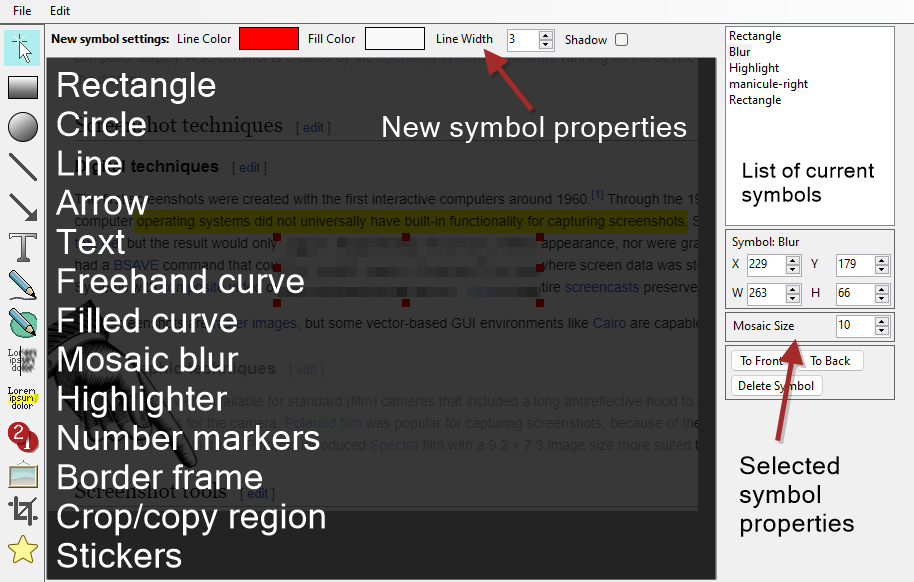

# ScreenShot Tool

A simple screenshot program, inspired by Greenshot, but each capture method can have individual settings for saving to file, clipboard or editor.

--------------------------------------------------------------------------------------

## Hotkeys

Hotkeys can be changed in **Options**

<!---CW:2000:4000:-->
| **Funcion**      | **Default Hotkey**          |
|------------------|-----------------------------|
| Region           | Printscreen                 |
| Window           | Alt + PrintScreen           |
| Screen           | Ctrl + PrintScreen          |
| All screens      | No preset                   |
| Open last folder | No preset                   |

--------------------------------------------------------------------------------------

# Capture Modes

- Region
- Window
- Screen
- All screens

--------------------------------------------------------------------------------------

## Region capture

During region capture, the current screen the mouse cursor is on will display a region selection interface.  
Click and drag the mouse to create a selection. This can be refined with the keys shown below.

To confirm the region, press Enter to save to file, C to copy the selection to the clipboard or E to open the selection in the Editor. Press Escape to exit.

If you select the option "Complete capture when releasing mouse", the output is instead decided by the otions for saving to file or clipboard (Options > Modes: Region)

When adjusting the size of the region, arrows will indicate what edges are affected by arrow key presses.
When adjusting the position of the region, arrows are shown in all directions.

    Enter           Save image to file and exit Region capture
    C               Copy image to clipboard and exit Region capture
    E               Open the selection in the Editor and exit Region capture
    Esc             Exit region capture, discard selection
    S               Size adjustment mode (Default)
    P               Position adjustment mode
    Ctrl+Arrow Key  Size adjustemt side selection
    Arrow Key       Size / Position adjustement
    Shift           Hold Shift to adjust region by 10 pixels instead of 1

#### Region framerate

The specified framerate in Options sets the max amount of times per second the region UI will update.  
If this is too high, the system can't catch up, and lag may be worse than if you set a lower framerate.
A good system should be able to handle 60fps. Default is 30fps.
(Options > Mode: Region)

--------------------------------------------------------------------------------------

## Window capture

Captures the active window.
Save to file, open in Editor or copy to clipboard based on options (Options > Modes: Window)

--------------------------------------------------------------------------------------

## Screen capture

Captures the screen the mouse cursor is currently in.
Save to file, open in Editor or copy to clipboard based on options (Options > Modes: Window)

--------------------------------------------------------------------------------------

## All Screens capture

Captures all screen in a single image.
Save to file, open in Editor or copy to clipboard based on options (Options > Modes: Window)

--------------------------------------------------------------------------------------

# Capture output

### File name variables

When saving to file, the name of the active application, time or incrementing numbers can be included in the file or folder name.  
The default file name is "$w $d $t $c", which will output something like "MyWindow 2023-12-31 16:02 003"

    $w      Active Window title ("Region" or "Screen" is used in those modes)
    $d      Date in ISO format (2023-12-31)
    $t      Time
    $ms     Milliseconds
    $c      Counter number (auto increments)

You can also use longer form variables, these are identical to Greenshot's variable format.

    ${DATE}         Date in ISO format (2023-12-31)
    ${YYYY}         Year
    ${MM}           Month number
    ${DD}           Day number
    ${hh}           Hour
    ${mm}           Minute
    ${ss}           Second
    ${ms}           Millisecond
    ${NUM}          Counter number (auto increments)
    ${title}        Active Window title ("Region" or "Screen" is used in those modes)
    ${user}         User account name
    ${domain}       User's domain
    ${hostname}     PC name

### Title tweaks

The title of the active window when using $w can be adjusted to make file names nicer.

#### Window title max length

Limits the name length to prevent long file names.

#### Split Window title using string

If a window title is dynamically altered by the file it's viewing, extract just the part you're interested in.  

Which of the split name element to use is set by the option "Keep split text in index", where 0 is the first element.

    Example: "ImageEditor - mypicture.png - v12.2"
      
    Split with " - "
     
    Keep split text in index: 0
    Result: $w outputs "ImageEditor"
     
    Keep split text in index: 1
    Result: $w outputs "mypicture.png"

#### Crop Window capture

If on, this option crops the captured window from top, left, right and bottom.  
This can be used to remove the window title bar and edges. In the Windows 11 default theme, values of 32,10,10,10 will remove these.

#### Counter number

When using the $c or ${NUM} variable, it inserts the number in this field. The number is saved between sessions.

--------------------------------------------------------------------------------------

# Screenshot Editor

You can open an image in the editor by using the Edit menu in the main application window, or when performing a region capture by pressing E.

Select the type of graphic symbol to add from the vertical list on the left. The new symbol will be added with the colors and settings at the top of the window.

You can move, edit and scale symbols after you have placed them by clicking and dragging the symbol, or using the Properties panel on the right.

<!---CW:2000:4000:-->
| **Keys**           | **Function**                               |
|--------------------|--------------------------------------------|
| Ctrl+C             | Copy the current image or selected region  |
| Ctrl+V             | Paste an image or text into the editor     |
| Arrow keys         | Move the selected symbol(s) around         |
| Shift + Arrow keys | Move the selected symbol(s) faster         |
| Shift + drag       | Scale proportional or create square symbol |
| Ctrl + click       | Multi select or deselect symbol            |
| Home               | Move the selected symbol to the front      |
| End                | Move the selected symbol to the back       |
| Enter              | Complete an active crop selection          |
| Esc / right click  | Cancel drawing a symbol                    |
| Delete             | Delete selected symbol(s)                  |
| Ctrl+O             | Open a file                                |
| Ctrl+S             | Save the current image (Save As)           |
| Ctrl+P             | Print the current image                    |

# Application options

#### Start Hidden

Start the application without appearing on screen or on the task bar. Interact with it via the System Tray icon or hotkeys.
You can add the application to start automatically by placing a shortcut in the Startup folder: *%appdata%\Microsoft\Windows\Start Menu\Programs\Startup*

#### System tray tooltips

System tray tooltip options will display a notification in the lowe right of the screen when capturing, creating folders, or there's a problem.

#### Thumbnails

Specify the size of the thumbnails used in the application. This does not affect the saved files.
"Crop thumbnails" will make the thumbnails retain their aspect ration, but parts of the image are cut in the capture list thumbnail.

-----------------------------------------

## Key codes for hotkey options:

https://learn.microsoft.com/en-us/dotnet/api/system.windows.forms.keys?view=windowsdesktop-7.0

<!---CW:6000:2000:-->
| **Key**                          | **Keycode**         |
|----------------------------------|---------------------|
| 0-9                              | 0 to 9              |
| A-Z                              | A to Z              |
| F1-F24                           | F1 to F24           |
| The BACKSPACE key                | Back                |
| The TAB key                      | Tab                 |
| The RETURN key                   | Return              |
| The ENTER key                    | Enter               |
| The PAUSE key                    | Pause               |
| The CAPS LOCK key                | CapsLock            |
| The ESC key                      | Escape              |
| The SPACEBAR key                 | Space               |
| The PAGE UP key                  | PageUp              |
| The PAGE DOWN key                | PageDown            |
| The END key                      | End                 |
| The HOME key                     | Home                |
| The LEFT ARROW key               | Left                |
| The UP ARROW key                 | Up                  |
| The RIGHT ARROW key              | Right               |
| The DOWN ARROW key               | Down                |
| The PRINT SCREEN key             | PrintScreen         |
| The INS key                      | Insert              |
| The DEL key                      | Delete              |
| The left Windows logo key        | LWin                |
| The right Windows logo key       | RWin                |
| The 0 key on the numeric keypad  | NumPad0             |
| The 1 key on the numeric keypad  | NumPad1             |
| The 2 key on the numeric keypad  | NumPad2             |
| The 3 key on the numeric keypad  | NumPad3             |
| The 4 key on the numeric keypad  | NumPad4             |
| The 5 key on the numeric keypad  | NumPad5             |
| The 6 key on the numeric keypad  | NumPad6             |
| The 7 key on the numeric keypad  | NumPad7             |
| The 8 key on the numeric keypad  | NumPad8             |
| The 9 key on the numeric keypad  | NumPad9             |
| The Multiply key                 | Multiply            |
| The Add key                      | Add                 |
| The Separator key                | Separator           |
| The Subtract key                 | Subtract            |
| The Decimal key                  | Decimal             |
| The Divide key                   | Divide              |
| The NUM LOCK key                 | NumLock             |
| The SCROLL LOCK key              | Scroll              |
| The OEM angle bracket or backslash key on the RT 102 key keyboard    | OemBackslash     |
| The OEM close bracket key on a US standard keyboard                  | OemCloseBrackets |
| The OEM comma key on any country/region keyboard                     | Oemcomma         |
| The OEM minus key on any country/region keyboard                     | OemMinus         |
| The OEM open bracket key on a US standard keyboard                   | OemOpenBrackets  |
| The OEM period key on any country/egion keyboard                     | OemPeriod        |
| The OEM pipe key on a US standard keyboard                           | OemPipe          |
| The OEM plus key on any country/region keyboard                      | Oemplus          |
| The OEM question mark key on a US standard keyboard                  | OemQuestion      |
| The OEM singled/double quote key on a US standard keyboard           | OemQuotes        |
| The OEM Semicolon key on a US standard keyboard                      | OemSemicolon     |
| The OEM tilde key on a US standard keyboard                          | Oemtilde         |