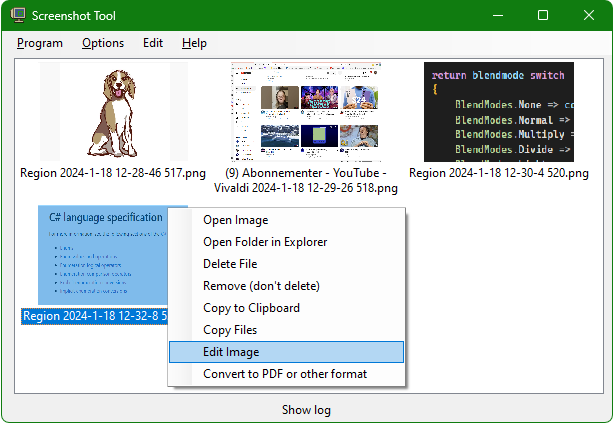

#  ScreenShotTool

## Hotkeys

Hotkeys can be changed in **Options**

| *Funcion*        | _Default Hotkey_            |
|------------------|-----------------------------|
| Region           | *Printscreen*               |
| Window           | Alt + PrintScreen           |
| Screen           | Ctrl + PrintScreen          |
| All screens      | No preset                   |
| Open last folder | No preset                   |

--------------------------------------------------------------------------------------

*A minimalist screenshot program.*
Each capture method can have individual settings for saving to file or clipboard.

an orphan ** tag
normal
ending **
normal
** start

Text **bold** and *italic* here
**bold alone**
normal
text **bold end**
normal
**bold** start
two **bold** things end **boldly**
more **bold** things **boldly** go

*italic* start
end *italic*
middle *italic* text
two *italic* and *italic*
moare *italic* and *italic* ending
*italic* and *italic* at start

--------------------------------------------------------------------------------------

